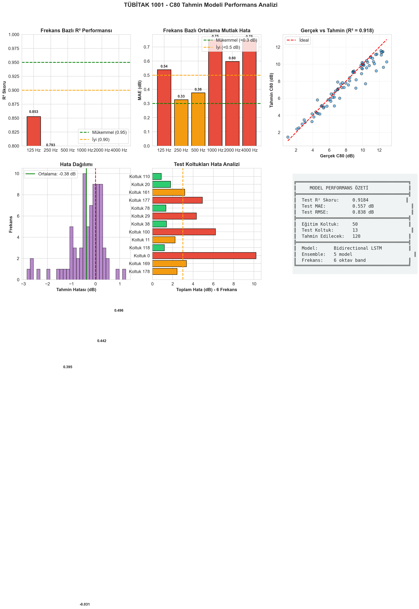
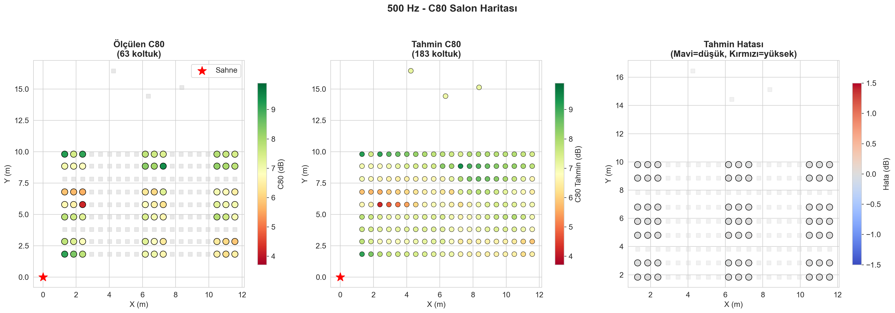
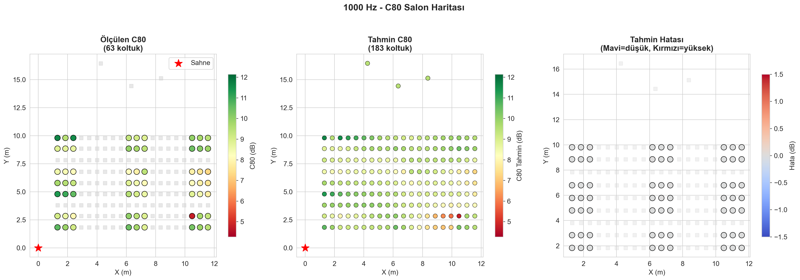
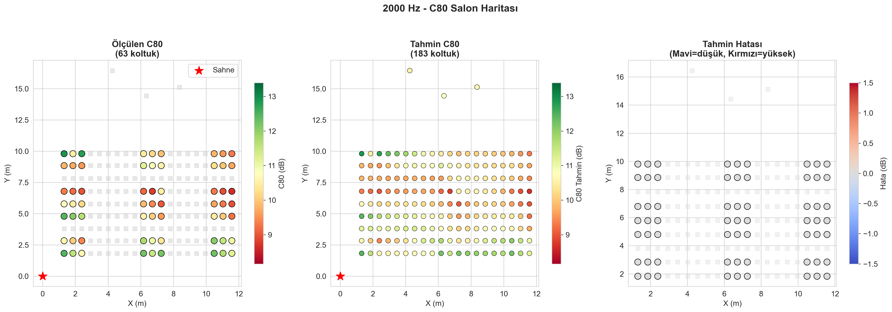

# Konser Salonu C80 Akustik Parametresi Tahmini

**TÜBİTAK 1001 Projesi**

63 ölçülmüş koltuktan 120 bilinmeyen koltuk için C80 (Clarity) tahmini.

---

## Veri Seti

| Özellik | Değer |
|---------|-------|
| Toplam koltuk | 183 |
| Ölçülmüş | 63 (%34) |
| Tahmin edilecek | 120 (%66) |
| Frekans bantları | 125, 250, 500, 1000, 2000, 4000 Hz |

---

## Model

**Bidirectional LSTM + Ensemble**

- 2 katmanlı Bidirectional LSTM
- 5 model ensemble
- IDW interpolasyon ile adaptive fusion
- 21 özellik (geometrik, duvar, graf)

```
Input (21 feature) → Encoder → BiLSTM → Decoder → C80 (6 frekans)
                                    ↓
                              IDW Fusion (α=0.62)
```

---

## Performans

### Test Sonuçları (13 koltuk, %20)

| Metrik | Değer |
|--------|-------|
| R² | 0.918 |
| MAE | 0.56 dB |
| RMSE | 0.84 dB |

### Frekans Bazlı

| Frekans | R² | MAE |
|---------|-----|-----|
| 125 Hz | 0.85 | 0.54 dB |
| 250 Hz | 0.79 | 0.33 dB |
| 500 Hz | 0.40 | 0.38 dB |
| 1000 Hz | -0.03 | 0.75 dB |
| 2000 Hz | 0.44 | 0.60 dB |
| 4000 Hz | 0.50 | 0.75 dB |

> 1000 Hz bandında düşük R², veri varyansının az olmasından kaynaklanmaktadır.

---

## Grafikler

### Performans Analizi


### Salon Haritaları

| 500 Hz | 1000 Hz | 2000 Hz |
|--------|---------|---------|
|  |  |  |

---

## Dosyalar

```
TUBITAK_C80_Projesi/
├── C80_Final_Model.ipynb      # Ana notebook
├── C80_Final_Model.pth        # Eğitilmiş model
├── C80_Final_Tahminler.xlsx   # Tüm tahminler
├── C80_Performans_Analizi.png # Performans grafikleri
├── C80_Salon_500Hz.png        # 500 Hz harita
├── C80_Salon_1000Hz.png       # 1000 Hz harita
├── C80_Salon_2000Hz.png       # 2000 Hz harita
├── salon.xlsx                 # Kaynak veri
└── TUBITAK.docx               # Proje dokümanı
```

---

## Kullanım

```python
import torch

# Model yükle
checkpoint = torch.load('C80_Final_Model.pth')
# checkpoint['ensemble_models'] - 5 model state_dict
# checkpoint['feature_scaler'] - StandardScaler
# checkpoint['c80_scaler'] - StandardScaler
```

---

## Gereksinimler

- Python 3.10+
- PyTorch 2.0+ (CUDA)
- pandas, numpy, scikit-learn
- matplotlib, seaborn

---

## Sonuç

- 120 koltuk için 6 frekans bandında C80 tahmini yapıldı
- Genel R² = 0.92, MAE = 0.56 dB
- Düşük-orta frekanslar (125-500 Hz) daha iyi tahmin edildi
- Yüksek frekanslarda (1000-4000 Hz) hata marjı ~0.7 dB

---

**Araştırmacı:** Abdulsamet  
**Kurum:** TÜBİTAK 1001
